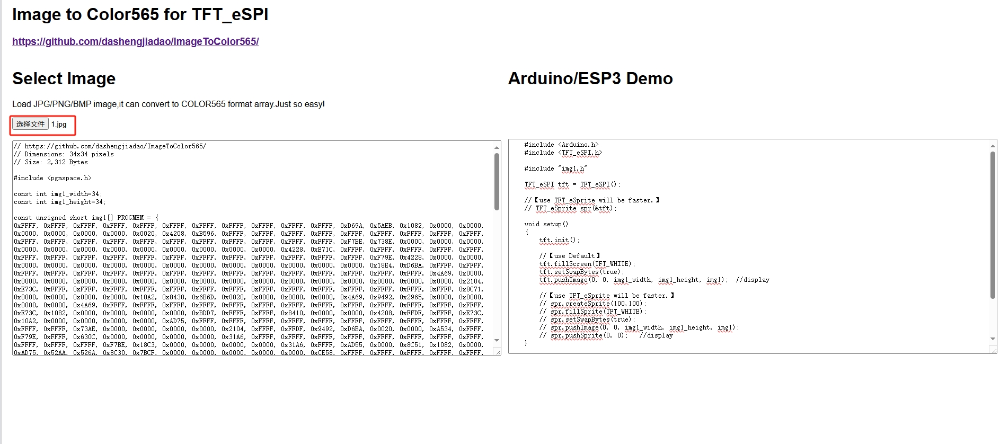

# Image to Color565 for TFT_eSPI v1.0
Load image(jpg/png/bmp) to color565 hex array,for TFT_eSPI ES32/Arduino/Etc

# How to use 
It's very easy. 

## 1. browser "convert.htm" page. 
## 2. load Image file and save to "img1.h" file.

## 3. compile Arduino code.
base 
```
    #include <Arduino.h>
    #include <TFT_eSPI.h>

    #include "img1.h"

    TFT_eSPI tft = TFT_eSPI();

    //【use TFT_eSprite will be faster.】
    // TFT_eSprite spr(&tft);

    void setup()
    {
        tft.init();

        //【use Default】
        tft.fillScreen(TFT_WHITE);
        tft.setSwapBytes(true);
        tft.pushImage(0, 0, img1_width, img1_height, img1);  //display

        //【use TFT_eSprite will be faster.】
        // spr.createSprite(100,100);
        // spr.fillSprite(TFT_WHITE);
        // spr.setSwapBytes(true);
        // spr.pushImage(0, 0, img1_width, img1_height, img1);
        // spr.pushSprite(0, 0);   //display
    }

    void loop()
    {

    }

```
